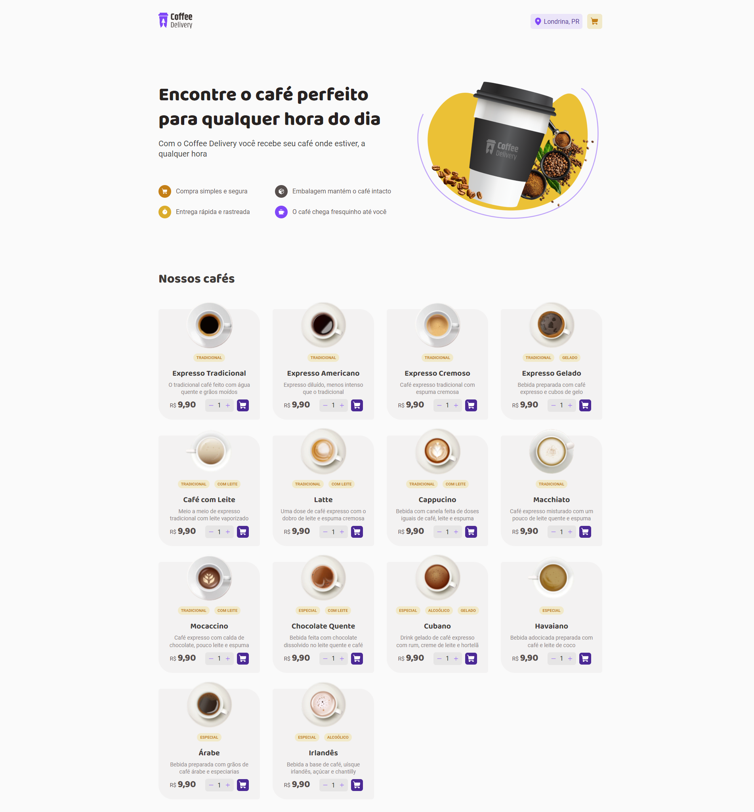
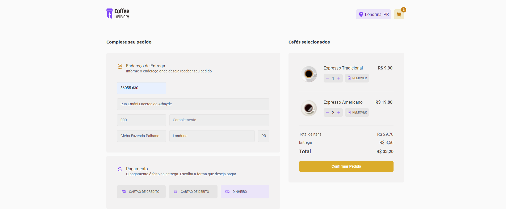
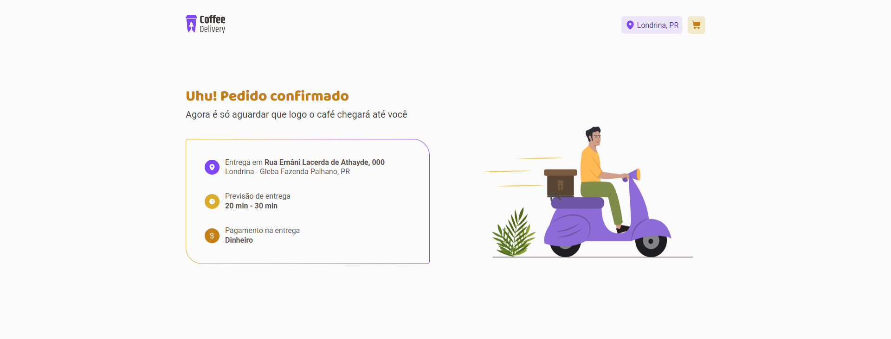

<h1 align="center">
    
</h1>

<span align="center">
    
</span>

Esse projeto simula um e-commerce simples de uma cafeteria fictícia, tendo como funcionalidades a listagem de produtos em um carrinho de compras, adicionar produtos no carrinho, aumentar e diminuir a quantidade de cada item do carrinho, exibir o total de itens e calcular o valor total da soma. Utilizando contextos e rotas, é possível navegar entre as páginas repassando as informações de entrada do usuário.

## 🛠️ Construído com

Esse projeto foi desenvolvido com as seguintes tecnologias:

- [Vite](https://vitejs.dev)
- [ReactJS](https://reactjs.org)
- [TypeScript](https://www.typescriptlang.org/)
- [Styled Components](https://styled-components.com)

### 📋 Pré-requisitos

Para clonar e rodar essa aplicação, será necessário o [Git](https://git-scm.com) e o [Node.js][nodejs] instalados no seu computador.

### 🔧 Como usar

```bash
# Clone este repositório
$ git clone https://github.com/guispati/Coffee-Delivery.git

# Abra a pasta criada
$ cd Coffee-Delivery

# Instale as dependências
$ npm install

# Inicie o projeto
$ npm run dev
```

## 💻 Demonstração

Na tela inicial você pode visualizar os produtos cadastrados e comprar um ou mais cafés adicionando-os ao carrinho de compras:


Ao clicar no ícone do carrinho no topo da página, você será redirecionado a pagina do carrinho de compras, permitindo fazer alterações nos itens do carrinho e ao final das alterações, concluir o seu processo de compra preenchendo o formulário. Ao preencher o campo CEP, o sistema automaticamente faz uma requisição a API do Correios para retornar os dados referentes áquele CEP preenchidos no formulário:


Ao preencher os seus dados de envio e pagamento, você será redirecionado a tela de confirmação do pedido, onde são exibidos os dados preenchidos no formulário:


## 📄 Licença

Este projeto está sob a licença MIT - veja o arquivo [LICENSE.md](LICENSE.md) para mais detalhes.

---
⌨️ com ❤️ por [Guilherme Spati](https://github.com/guispati) 😊